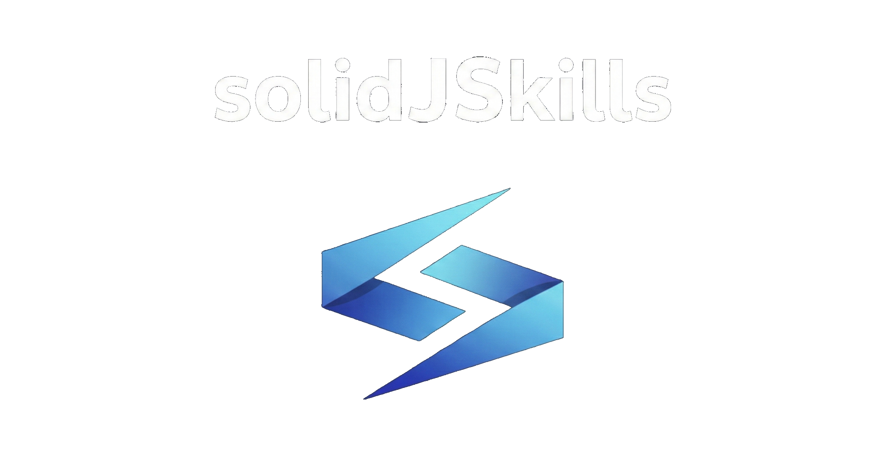

# solidJSkills



## What is this?

I work with SolidJS and wanted my AI coding agent to actually be helpful with it. I couldn't find anything out there focused on SolidJS, so I built this.

This is a collection of SolidJS-focused skills, guides, and documentation designed to work with AI agents via the Model Context Protocol (MCP). It was originally built as a Gemini-CLI extension, but it also works with Windsurf, Cursor, Antigravity, and other MCP-compatible clients.

<!-- TODO: Add screenshot of solidJSkills in action with Gemini-CLI -->

When you connect your AI agent to this, it gets:

- **SolidJS knowledge**: Guides and references for SolidJS v2 patterns, reactivity, routing, SSR, etc.
- **Specific skills**: Workflows for refactoring, testing, building components, reviewing code, and scaffolding projects
- **Validation tools**: Scripts to check that code follows SolidJS best practices

Beyond just SolidJS stuff, this repo also has useful guides on building your own skills, creating rules, and setting up workflows — helpful if you're building your own MCP skill projects.

## Getting Started

The MCP server is what lets your AI agent talk to this repository. It's included in the `mcp-server` directory.

### Install the MCP Server

```bash
cd mcp-server
npm install
```

You can test that it starts correctly (it uses stdio, so it'll just wait for input):

```bash
node src/index.js
```

*(Press `Ctrl+C` to exit)*

## Setup with Gemini-CLI (Primary)

This project was originally built for Gemini-CLI, so that's the recommended setup.

<!-- TODO: Add screenshot of Gemini-CLI configuration -->

**Method 1: Using gemini-extension.json (Recommended)**

The easiest way is to use the included `gemini-extension.json` file:

1. Copy or symlink `gemini-extension.json` to your Gemini-CLI extensions directory
2. Edit the paths to point to your local clone of this repo

**Method 2: Manual Configuration**

If you prefer to configure manually, see the [GEMINI.md](GEMINI.md) file for detailed setup instructions.

## Setup with Other IDEs

### Windsurf / Cascade

Add this to your `~/.codeium/windsurf/mcp_config.json`:

```json
{
  "mcpServers": {
    "solidjskills": {
      "command": "node",
      "args": ["/ABSOLUTE/PATH/TO/solidJSkills/mcp-server/src/index.js"],
      "cwd": "/ABSOLUTE/PATH/TO/solidJSkills/mcp-server"
    }
  }
}
```

**Note:** Replace `/ABSOLUTE/PATH/TO/...` with the actual path on your machine.

### Cursor

1. Open **Cursor Settings** > **Features** > **MCP**
2. Click **+ Add New MCP Server**
3. Fill in:
   - **Name**: `solidjskills`
   - **Type**: `command`
   - **Command**: `node /ABSOLUTE/PATH/TO/solidJSkills/mcp-server/src/index.js`
4. Click **Save**

### Antigravity & Other MCP Clients

Most MCP clients need a command to start the server. Use:

- **Command**: `node`
- **Args**: `/ABSOLUTE/PATH/TO/solidJSkills/mcp-server/src/index.js`

## Contributing

Want to add new skills or improve the documentation? Here's how:

1. **Adding a skill**: Create a new directory in `skills/` (e.g., `skills/solid-my-new-skill/`) and add a `SKILL.md` file. Check out `tools/templates/SKILL-template.md` for the format.
2. **Adding documentation**: Put detailed docs in `references/`.
3. **Improving guides**: The `guides/` directory has instructions for building skills, creating rules, and setting up workflows. Feel free to improve them or add new ones.

If you want to understand how everything is wired together under the hood, check out the [architecture docs](docs/ARCHITECTURE.md).

## License

MIT — See [LICENSE](LICENSE) for details.
